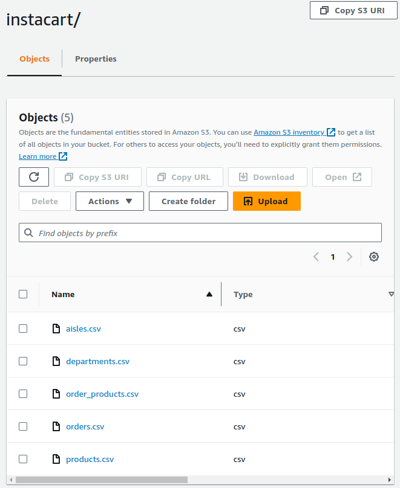
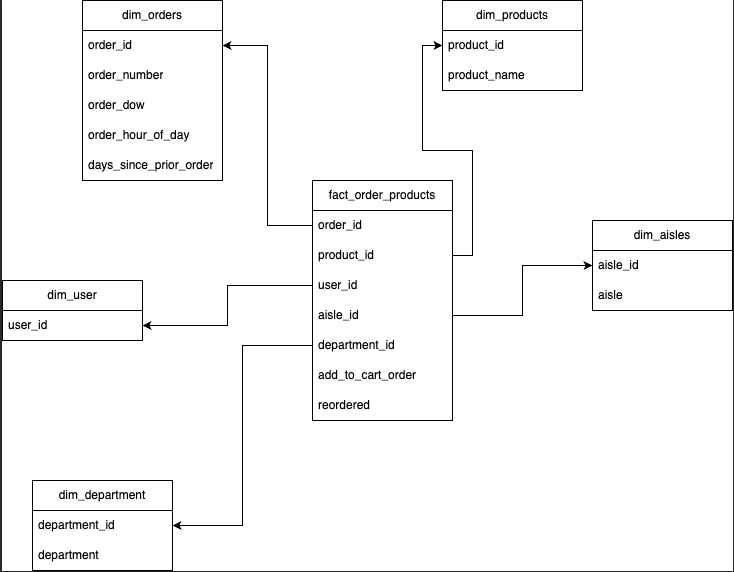
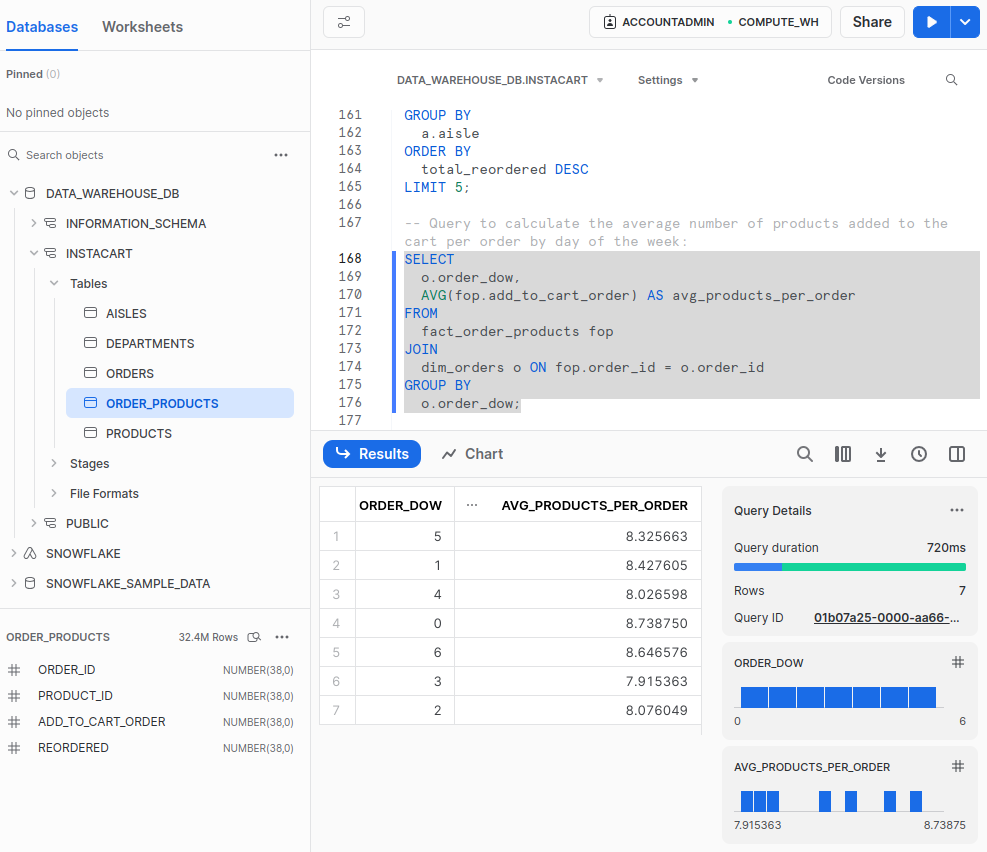

# SnowflakeDB E-Commerce Dim Modelling Project

Dimensional modelling is a technique used in data warehousing that involves organizing data into facts and dimensions. This makes it easier to understand complex data and analyse it in a way that is meaningful to businesses.

Facts:

- Numeric data representing measurable business metrics (e.g., sales revenue, quantity sold, etc.).
- Typically stored in a fact table.

Dimensions:

- Descriptive information that provides context to the facts.
- Consist of hierarchies and descriptive attributes.
- Stored in dimension tables.

Fact Table:

- Central to the dimensional model.
- Contains quantitative data (facts) and foreign keys referencing related dimension tables.
- Often contains additive numeric values that can be aggregated (e.g., sales amount).

Dimension Table:

- Contains attributes that provide context to the facts.
- Can be hierarchically structured (e.g., date dimension with year, month, day).
- Typically used for filtering, grouping, and slicing data.


Advantages:
- Simplified Querying - Optimized for querying and reporting, facilitating faster access to information. Users can easily navigate hierarchies and dimensions for analysis.
- Improved Performance - Aggregations and summarisation are efficient due to the structure of fact tables containing pre-aggregated data.
- Business Understanding - Reflects business processes and provides a clear representation of business operations.
- Scalability and Flexibility - Easily adaptable to changing business requirements.
New dimensions or facts can be added without affecting the existing structure.

**Dataset:** [Instacart Market Basket Analysis](https://www.kaggle.com/competitions/instacart-market-basket-analysis/data)

# Project Outline
1. Project Setup and Data Aquisition
    - Set project objectives and acquire the data set from the relevant source
    - Set IAM user privileges
    - Upload Instacart Data Set CSV files to Amazon S3 Bucket
2. Follow Kimball Dimensional Design process
    1. Select the business processes
    2. Declare the grain (Grain for dataset is on Order Level)
    3. Identify the Dimensions
    4. Identify the facts
3. Data preparation and Loading
    - In Snowflake, create the database, schema, stage, and file FORMAT and provide the credentials to obtain the dataset CSV files from S3
    - Create or define the appropriate tables in the database based on the dataset's schema
    - Write SQL statements to create the tables (Orders, Products, Aisles, Departments, etc.) in the database
    - Load the data from CSV files into the respective tables
4. Designing the data modelling
    - Implement the star schema using Dimensional Modelling principles
    - Create the dimension tables (dim_users, dim_products, dim_aisles, dim_departments, dim_orders) containing relevant attributes
    - Formulate the fact table (fact_order_products) by joining necessary tables to consolidate the key metrics and dimensions
5. Analytics and Insights
    - Create SQL queries to extract actionable insights from the data


## DataSet Tables Overview

### Orders Table:

| Column Name           | Data Type | Description                              |
|-----------------------|-----------|------------------------------------------|
| order_id              | integer   | Unique identifier for an order            |
| user_id               | integer   | Unique identifier for a user             |
| order_number          | integer   | A counter for the orders of a user       |
| order_dow             | integer   | The day of the week the order was placed |
| order_hour_of_day     | integer   | The hour of the day the order was placed |
| days_since_prior_order| integer   | Number of days since the previous order  |

### Products Table:

| Column Name   | Data Type | Description                        |
|---------------|-----------|------------------------------------|
| product_id    | integer   | Unique identifier for a product    |
| product_name  | varchar   | Name of the product                |
| aisle_id      | integer   | Unique identifier for an aisle     |
| department_id | integer   | Unique identifier for a department |

### Order Products Table:

| Column Name      | Data Type | Description                                   |
|------------------|-----------|-----------------------------------------------|
| order_id         | integer   | Unique identifier for an order                 |
| product_id       | integer   | Unique identifier for a product               |
| add_to_cart_order| integer   | The order in which the product was added      |
| reordered        | boolean   | Has the product been ordered by this user?    |

### Aisles Table:

| Column Name | Data Type | Description                   |
|-------------|-----------|-------------------------------|
| aisle_id    | integer   | Unique identifier for an aisle|
| aisle       | varchar   | Name of the aisle             |

### Departments Table:

| Column Name   | Data Type | Description                     |
|---------------|-----------|---------------------------------|
| department_id | integer   | Unique identifier for a department |
| department    | varchar   | Name of the department          |

## Upload Dataset CSV files to S3


## SQL Statements

### Building Stage and File Format

```sql
CREATE STAGE my_stage
URL = 's3://snowflakedb-dim-modelling/instacart//'
CREDENTIALS = (AWS_KEY_ID = '' AWS_SECRET_KEY = '');

CREATE OR REPLACE FILE FORMAT csv_file_format
TYPE = 'CSV'
FIELD_DELIMITER = ','
SKIP_HEADER = 1
FIELD_OPTIONALLY_ENCLOSED_BY='"'; -- If the CSV file has a header row, skip it
```

### Loading Data Into Tables

```sql
-- Aisles Table
CREATE TABLE aisles (
    aisle_id INTEGER PRIMARY KEY,
    aisle VARCHAR
);

COPY INTO aisles (aisle_id, aisle)
FROM @my_stage/aisles.csv
FILE_FORMAT = (FORMAT_NAME = 'csv_file_format');

-- Departments Table
CREATE TABLE departments (
    department_id INTEGER PRIMARY KEY,
    department VARCHAR
);

COPY INTO departments (department_id, department)
FROM @my_stage/departments.csv
FILE_FORMAT = (FORMAT_NAME = 'csv_file_format');

-- Products Table
CREATE OR REPLACE TABLE products (
    product_id INTEGER PRIMARY KEY,
    product_name VARCHAR,
    aisle_id INTEGER,
    department_id INTEGER
);

COPY INTO products (product_id, product_name, aisle_id, department_id)
FROM @my_stage/products.csv
FILE_FORMAT = (FORMAT_NAME = 'csv_file_format');

-- Orders Table
CREATE OR REPLACE TABLE orders (
    order_id INTEGER PRIMARY KEY,
    user_id INTEGER,
    eval_set STRING,
    order_number INTEGER,
    order_dow INTEGER,
    order_hour_of_day INTEGER,
    days_since_prior_order INTEGER
);

COPY INTO orders (order_id, user_id, eval_set, order_number, order_dow, order_hour_of_day, days_since_prior_order)
FROM @my_stage/orders.csv
FILE_FORMAT = (FORMAT_NAME = 'csv_file_format');

-- Order Products Table
CREATE OR REPLACE TABLE order_products (
    order_id INTEGER,
    product_id INTEGER,
    add_to_cart_order INTEGER,
    reordered INTEGER,
    PRIMARY KEY (order_id, product_id)
);

COPY INTO order_products (order_id, product_id, add_to_cart_order, reordered)
FROM @my_stage/order_products.csv
FILE_FORMAT = (FORMAT_NAME = 'csv_file_format');
```


### Creating Instacart Star Schema



### Building Dim Fact Tables

```sql
-- Dimension Tables
CREATE OR REPLACE TABLE dim_users AS (
  SELECT
    user_id
  FROM
    orders
);

CREATE OR REPLACE TABLE dim_products AS (
  SELECT
    product_id,
    product_name
  FROM
    products
);

CREATE OR REPLACE TABLE dim_aisles AS (
  SELECT
    aisle_id,
    aisle
  FROM
    aisles
);

CREATE OR REPLACE TABLE dim_departments AS (
  SELECT
    department_id,
    department
  FROM
    departments
);

CREATE OR REPLACE TABLE dim_orders AS (
  SELECT
    order_id,
    order_number,
    order_dow,
    order_hour_of_day,
    days_since_prior_order
  FROM
    orders
);

-- Fact Table
CREATE TABLE fact_order_products AS (
  SELECT
    op.order_id,
    op.product_id,
    o.user_id,
    p.department_id,
    p.aisle_id,
    op.add_to_cart_order,
    op.reordered
  FROM
    order_products op
  JOIN
    orders o ON op.order_id = o.order_id
  JOIN
    products p ON op.product_id = p.product_id
);
```

### Analytics Queries

```sql
-- Total number of products ordered per department
SELECT
  d.department,
  COUNT(*) AS total_products_ordered
FROM
  fact_order_products fop
JOIN
  dim_departments d ON fop.department_id = d.department_id
GROUP BY
  d.department;

-- Top 5 aisles with the highest number of reordered products
SELECT
  a.aisle,
  COUNT(*) AS total_reordered
FROM
  fact_order_products fop
JOIN
  dim_aisles a ON fop.aisle_id = a.aisle_id
WHERE
  fop.reordered = TRUE
GROUP BY
  a.aisle
ORDER BY
  total_reordered DESC
LIMIT 5;

-- Average number of products added to the cart per order by day of the week
SELECT
  o.order_dow,
  AVG(fop.add_to_cart_order) AS avg_products_per_order
FROM
  fact_order_products fop
JOIN
  dim_orders o ON fop.order_id = o.order_id
GROUP BY
  o.order_dow;

-- Top 10 users with the highest number of unique products ordered
SELECT
  u.user_id,
  COUNT(DISTINCT fop.product_id) AS unique_products_ordered
FROM
  fact_order_products fop
JOIN
  dim_users u ON fop.user_id = u.user_id
GROUP BY
  u.user_id
ORDER BY
```
#### Query: Top 10 users with the highest number of unique products ordered


#### Query: Average number of products added to the cart per order by day of the week

