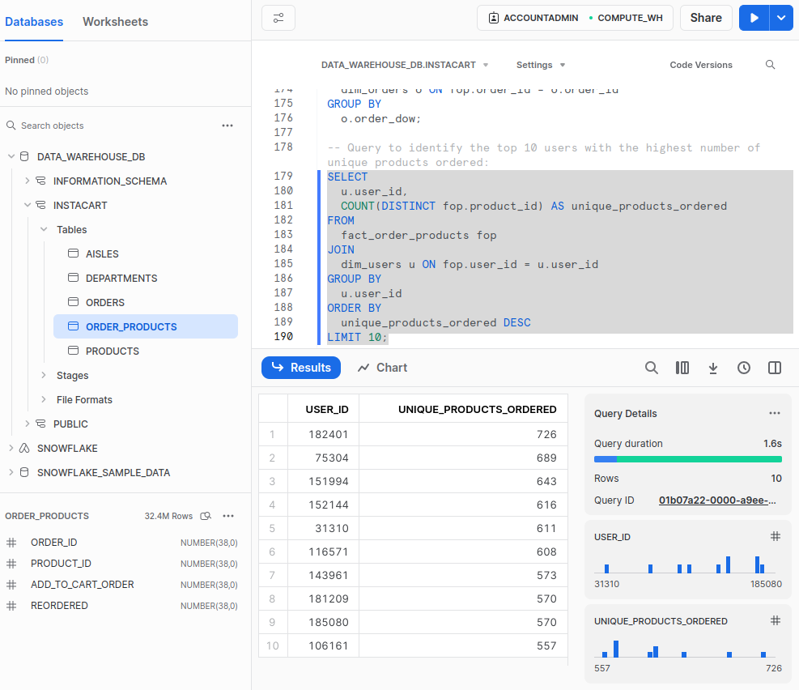

# SnowflakeDB E-Commerce Dim Modelling Project

Dimensional modelling is a technique used in data warehousing that involves organizing data into facts and dimensions. This makes it easier to understand complex data and analyse it in a way that is meaningful to businesses.

Facts:

- Numeric data representing measurable business metrics (e.g., sales revenue, quantity sold, etc.).
- Typically stored in a fact table.

Dimensions:

- Descriptive information that provides context to the facts.
- Consist of hierarchies and descriptive attributes.
- Stored in dimension tables.

Fact Table:

- Central to the dimensional model.
- Contains quantitative data (facts) and foreign keys referencing related dimension tables.
- Often contains additive numeric values that can be aggregated (e.g., sales amount).

Dimension Table:

- Contains attributes that provide context to the facts.
- Can be hierarchically structured (e.g., date dimension with year, month, day).
- Typically used for filtering, grouping, and slicing data.


Advantages:
- Simplified Querying - Optimized for querying and reporting, facilitating faster access to information. Users can easily navigate hierarchies and dimensions for analysis.
- Improved Performance - Aggregations and summarisation are efficient due to the structure of fact tables containing pre-aggregated data.
- Business Understanding - Reflects business processes and provides a clear representation of business operations.
- Scalability and Flexibility - Easily adaptable to changing business requirements.
New dimensions or facts can be added without affecting the existing structure.

**Dataset:** [Instacart Market Basket Analysis](https://www.kaggle.com/competitions/instacart-market-basket-analysis/data)

# Project Outline
1. Project Setup and Data Aquisition
    - Set project objectives and acquire the data set from the relevant source
    - Set IAM user privileges
    - Upload Instacart Data Set CSV files to Amazon S3 Bucket
2. Follow Kimball Dimensional Design process
    1. Select the business processes
    2. Declare the grain (Grain for dataset is on Order Level)
    3. Identify the Dimensions
    4. Identify the facts
3. Data preparation and Loading
    - In Snowflake, create the database, schema, stage, and file FORMAT and provide the credentials to obtain the dataset CSV files from S3
    - Create or define the appropriate tables in the database based on the dataset's schema
    - Write SQL statements to create the tables (Orders, Products, Aisles, Departments, etc.) in the database
    - Load the data from CSV files into the respective tables
4. Designing the data modelling
    - Implement the star schema using Dimensional Modelling principles
    - Create the dimension tables (dim_users, dim_products, dim_aisles, dim_departments, dim_orders) containing relevant attributes
    - Formulate the fact table (fact_order_products) by joining necessary tables to consolidate the key metrics and dimensions
5. Analytics and Insights
    - Create SQL queries to extract actionable insights from the data
6. SnowflakeDB Slowly Changing Dimensions (SCD)
    - Apply each type of SCD to the data using create and insert statements to generate table-like structures


# Data Modelling

## DataSet Tables Overview

### Orders Table:

| Column Name           | Data Type | Description                              |
|-----------------------|-----------|------------------------------------------|
| order_id              | integer   | Unique identifier for an order            |
| user_id               | integer   | Unique identifier for a user             |
| order_number          | integer   | A counter for the orders of a user       |
| order_dow             | integer   | The day of the week the order was placed |
| order_hour_of_day     | integer   | The hour of the day the order was placed |
| days_since_prior_order| integer   | Number of days since the previous order  |

### Products Table:

| Column Name   | Data Type | Description                        |
|---------------|-----------|------------------------------------|
| product_id    | integer   | Unique identifier for a product    |
| product_name  | varchar   | Name of the product                |
| aisle_id      | integer   | Unique identifier for an aisle     |
| department_id | integer   | Unique identifier for a department |

### Order Products Table:

| Column Name      | Data Type | Description                                   |
|------------------|-----------|-----------------------------------------------|
| order_id         | integer   | Unique identifier for an order                 |
| product_id       | integer   | Unique identifier for a product               |
| add_to_cart_order| integer   | The order in which the product was added      |
| reordered        | boolean   | Has the product been ordered by this user?    |

### Aisles Table:

| Column Name | Data Type | Description                   |
|-------------|-----------|-------------------------------|
| aisle_id    | integer   | Unique identifier for an aisle|
| aisle       | varchar   | Name of the aisle             |

### Departments Table:

| Column Name   | Data Type | Description                     |
|---------------|-----------|---------------------------------|
| department_id | integer   | Unique identifier for a department |
| department    | varchar   | Name of the department          |

## Upload Dataset CSV files to S3


## SQL Statements

### Building Stage and File Format

```sql
CREATE STAGE my_stage
URL = 's3://snowflakedb-dim-modelling/instacart//'
CREDENTIALS = (AWS_KEY_ID = '' AWS_SECRET_KEY = '');

CREATE OR REPLACE FILE FORMAT csv_file_format
TYPE = 'CSV'
FIELD_DELIMITER = ','
SKIP_HEADER = 1
FIELD_OPTIONALLY_ENCLOSED_BY='"'; -- If the CSV file has a header row, skip it
```

### Loading Data Into Tables

```sql
-- Aisles Table
CREATE TABLE aisles (
    aisle_id INTEGER PRIMARY KEY,
    aisle VARCHAR
);

COPY INTO aisles (aisle_id, aisle)
FROM @my_stage/aisles.csv
FILE_FORMAT = (FORMAT_NAME = 'csv_file_format');

-- Departments Table
CREATE TABLE departments (
    department_id INTEGER PRIMARY KEY,
    department VARCHAR
);

COPY INTO departments (department_id, department)
FROM @my_stage/departments.csv
FILE_FORMAT = (FORMAT_NAME = 'csv_file_format');

-- Products Table
CREATE OR REPLACE TABLE products (
    product_id INTEGER PRIMARY KEY,
    product_name VARCHAR,
    aisle_id INTEGER,
    department_id INTEGER
);

COPY INTO products (product_id, product_name, aisle_id, department_id)
FROM @my_stage/products.csv
FILE_FORMAT = (FORMAT_NAME = 'csv_file_format');

-- Orders Table
CREATE OR REPLACE TABLE orders (
    order_id INTEGER PRIMARY KEY,
    user_id INTEGER,
    eval_set STRING,
    order_number INTEGER,
    order_dow INTEGER,
    order_hour_of_day INTEGER,
    days_since_prior_order INTEGER
);

COPY INTO orders (order_id, user_id, eval_set, order_number, order_dow, order_hour_of_day, days_since_prior_order)
FROM @my_stage/orders.csv
FILE_FORMAT = (FORMAT_NAME = 'csv_file_format');

-- Order Products Table
CREATE OR REPLACE TABLE order_products (
    order_id INTEGER,
    product_id INTEGER,
    add_to_cart_order INTEGER,
    reordered INTEGER,
    PRIMARY KEY (order_id, product_id)
);

COPY INTO order_products (order_id, product_id, add_to_cart_order, reordered)
FROM @my_stage/order_products.csv
FILE_FORMAT = (FORMAT_NAME = 'csv_file_format');
```


### Creating Instacart Star Schema


### Building Dim Fact Tables

```sql
-- Dimension Tables
CREATE OR REPLACE TABLE dim_users AS (
  SELECT
    user_id
  FROM
    orders
);

CREATE OR REPLACE TABLE dim_products AS (
  SELECT
    product_id,
    product_name
  FROM
    products
);

CREATE OR REPLACE TABLE dim_aisles AS (
  SELECT
    aisle_id,
    aisle
  FROM
    aisles
);

CREATE OR REPLACE TABLE dim_departments AS (
  SELECT
    department_id,
    department
  FROM
    departments
);

CREATE OR REPLACE TABLE dim_orders AS (
  SELECT
    order_id,
    order_number,
    order_dow,
    order_hour_of_day,
    days_since_prior_order
  FROM
    orders
);

-- Fact Table
CREATE TABLE fact_order_products AS (
  SELECT
    op.order_id,
    op.product_id,
    o.user_id,
    p.department_id,
    p.aisle_id,
    op.add_to_cart_order,
    op.reordered
  FROM
    order_products op
  JOIN
    orders o ON op.order_id = o.order_id
  JOIN
    products p ON op.product_id = p.product_id
);
```

### Analytics Queries

```sql
-- Total number of products ordered per department
SELECT
  d.department,
  COUNT(*) AS total_products_ordered
FROM
  fact_order_products fop
JOIN
  dim_departments d ON fop.department_id = d.department_id
GROUP BY
  d.department;

-- Top 5 aisles with the highest number of reordered products
SELECT
  a.aisle,
  COUNT(*) AS total_reordered
FROM
  fact_order_products fop
JOIN
  dim_aisles a ON fop.aisle_id = a.aisle_id
WHERE
  fop.reordered = TRUE
GROUP BY
  a.aisle
ORDER BY
  total_reordered DESC
LIMIT 5;

-- Average number of products added to the cart per order by day of the week
SELECT
  o.order_dow,
  AVG(fop.add_to_cart_order) AS avg_products_per_order
FROM
  fact_order_products fop
JOIN
  dim_orders o ON fop.order_id = o.order_id
GROUP BY
  o.order_dow;

-- Top 10 users with the highest number of unique products ordered
SELECT
  u.user_id,
  COUNT(DISTINCT fop.product_id) AS unique_products_ordered
FROM
  fact_order_products fop
JOIN
  dim_users u ON fop.user_id = u.user_id
GROUP BY
  u.user_id
ORDER BY
```
#### Query: Top 10 users with the highest number of unique products ordered


#### Query: Average number of products added to the cart per order by day of the week


# Slowly Changing dimensions (SCD)

A slowly changing dimension (SCD) is a dimension that is able to handle data attributes which change over time.  It is considered and implemented as one of the most critical ETL tasks in tracking the history of dimension records.

For example: A customer dimension may hold attributes such as name, address, and phone number. Over time, a customer's details may change (e.g. move addresses, change phone number, etc).

To handle slowly changing dimensions in the real world: Be proactive by asking about potential changes, involve business + technical users, develop a strategy for each changing attribute

#### SCD Type 0: Retain Original
Refers to dimensions or attributes that never change and will not be updated in the data warehouse. Type 0 is applicable to most date dimension attributes and include Date of birth, Employee start date, and Social security Number
#### SCD Type 1: Overwrite
Refers to an instance where old data is overwritten with new data using update query. The old data is lost as it is not stored anywhere, and the latest snapshot of a record is maintained in the data warehouse without any historical records. The new queries will always return the most recent value. This SCD type requires less storage space but cannot keep track of changes over time, which may be required for analysis. Examples include Customer address data changes, Inventory data, Employee salary data
#### SCD Type 2: Add New Row
Known as the historical tracking method, maintains a complete history of change in a dimension table. Every time there is a change in the source system, a new row is added to the dimensions table with a unique identifier. The resulting table will retain the prior history, allowing full history tracking. There are several ways to handle SCD Type 2 dimensions:

- Using a Flag - Adding a flag column signifying the record that is currently active. The flag column uses a simple boolean flag (such as 0/1 or Y/N) to denote whether a specific record is currently active or a valid version. Example: Customer moves city. For the customerID we will have multiple records for different cities, and require a surrogate key to uniquely identify these rows. Every time there is a change, add a new row and update the isActive column of the previous rows to False. This way, querying the active values is possible by filtering on isActive=Tue criteria

- Using Version Numbers - Using version numbers allows keeping track of changes. The row with the highest version is the most current value. Add a new column named Version, and assign 0 for the city. For a change of address, add a new row with the version number 1 assigned. Filter on the MAX(Version) to get the most latest values

- Using date ranges - Adding one or two timestamp columns to signify when a new record was created or made active and when it was made inactive. Add two columns for startDate and endDate for the date range the row is active. Query on NULL for the endDate which signifies the latest record

- A variation to the date-range approach; combine the flag column to easily identify active or current records

Using SCD Type 2 means no data is lost as the history of a record is maintained but can be complex to implemented and requires more storage space. Adding records will increase table size and requires maintenance. Examples include Sales data: tracking item price or profit over time, customer or order data: tracking previous orders for recommendations of new items, customer address: adding new address entry with date range columns
#### SCD Type 3: Add New Attribute
Maintain only the partial history and not a complete history. Instead of adding a new row for every change, a new column is added to track the previous value. The SCD Type 3 stores two versions of values for the selected level attributes. Each record will store the current and previous values of the selected attribute. You can only track one change in a record rather than multiple changes over time. This method is not scalable if you want to preserve complete history. Can also add date columns to track modified dates but do not require surrogate keys as the identification key of a record does not change. For changing a customer city, add a new column called PrevCity, every time the city changes, add the previous value and update the City column as required. Benefit is fast queries due to limited history and less storage requirements. Examples include Product pricing or Financial reporting, where only previous and current values are important.
#### SCD Type 4: Add History Table
Introduced for dimension attributes that change relatively frequently. This SCD involves maintaining the records in two different tables - a current record table and a historical record table. While the main dimension table stays current, the history table stores past data. Also can split the fast changing attributes of the descension table into another smaller dimension table and reference the new dimension table directly from the fact table. With SCD Type 4, a record will be added to the history table for each change in the source system. Example: Product price changes - store frequently changing product prices in a smaller table to update, monthly carpool pass - store lastPurchased and validity data for the pass in a smaller table to update monthly.
#### SCD Type 6: Combined Approach
The SCD Type 6 is a hybrid approach of Type 1, Type 2, and Type 3 (1 + 2 + 3 = 6). This includes columns for both historical and current data and a column to track the current version of the record. A long with the addition of new rows, we update the latest value in all the rows, with the current version being easily accessible. This SCD type is useful when a business wants to view both current and historical data.

## SCD Implementation

Implementation of the concept of Slowly Changing Dimension (SCD) in SnowflakeDB and its types - SCD 1, SCD 2, SCD 3, and SCD 6 with examples using a customer table.

### Customer Table Creation

Create a customer table with basic columns and dummy data:

```sql
CREATE TABLE customer (
   customer_id INT,
   customer_name VARCHAR(50),
   customer_email VARCHAR(50),
   customer_phone VARCHAR(15),
   load_date DATE,
   customer_address VARCHAR(255)
);

INSERT INTO customer VALUES
   (1, 'John Doe', 'john.doe@example.com', '123-456-7890', '2022-01-01', '123 Main St'),
   (2, 'Jane Doe', 'jane.doe@example.com', '987-654-3210', '2022-01-01', '456 Elm St'),
   (3, 'Bob Smith', 'bob.smith@example.com', '555-555-5555', '2022-01-01', '789 Oak St');
```

Initial customer table:

| customer_id | customer_name | customer_email         | customer_phone | load_date      | CUSTOMER_ADDRESS |
|-------------|---------------|------------------------|----------------|----------------|------------------|
| 1           | John Doe      | john.doe@example.com   | 123-456-7890   | January 1, 2022 | 123 Main St      |
| 2           | Jane Doe      | jane.doe@example.com   | 987-654-3210   | January 1, 2022 | 456 Elm St       |
| 3           | Bob Smith     | bob.smith@example.com  | 555-555-5555   | January 1, 2022 | 789 Oak St       |


### SCD Type 1
The original data is simply overwritten with the new information

```sql
-- SCD Type 1
-- Update customer address for customer_id=2
UPDATE customer SET customer_address = '789 Maple St' WHERE customer_id = 2;

SELECT * FROM customer;
```

Updated customer table:
| customer_id | customer_name | customer_email         | customer_phone | load_date      | CUSTOMER_ADDRESS |
|-------------|---------------|------------------------|----------------|----------------|------------------|
| 1           | John Doe      | john.doe@example.com   | 123-456-7890   | January 1, 2022 | 123 Main St      |
| 2           | Jane Doe      | jane.doe@example.com   | 987-654-3210   | January 1, 2022 | **789 Mape St**       |
| 3           | Bob Smith     | bob.smith@example.com  | 555-555-5555   | January 1, 2022 | 789 Oak St       |


### SCD Type 2
instead of overwriting the original data, new records are created to store the historical changes. Each record contains a timestamp or version number, allowing you to track the complete history of changes. SCD Type 2 creates a new record for each change in the data, with a new surrogate key and load date. The old record remains in the table with an end date equal to the start date of the new record

```sql
-- SCD Type 2
-- Add columns for customer segment, start date, end date, and version
ALTER TABLE customer ADD COLUMN customer_segment VARCHAR(20);
ALTER TABLE customer ADD COLUMN start_date DATE;
ALTER TABLE customer ADD COLUMN end_date DATE;
ALTER TABLE customer ADD COLUMN version BIGINT DEFAULT 1;
SELECT * FROM customer;

-- Update customer segment for customer_id=2
-- enter dummy date for end date for future date
UPDATE customer SET customer_segment = 'Gold', start_date = '2022-02-01', end_date = '9999-12-31' WHERE customer_id = 2;
SELECT * FROM customer

-- Goal is to update customer segment from Gold to Platinum whilst maintaining complete historical changes.
-- Insert new record for customer_id=2 with Platinum customer segment
INSERT INTO customer (customer_id, customer_name, customer_email, customer_phone, customer_address, customer_segment, start_date, end_date, version, load_date)
   SELECT customer_id, customer_name, customer_email, customer_phone, customer_address, 'Platinum', '2022-03-01', '9999-12-31', version + 1, '2022-03-01' FROM customer WHERE customer_id = 2;

SELECT * FROM customer where customer_id = 2;
```
This returns 2 records for customer_id = 2, one with Gold segment and one with Platinum segment. The version numbers show the latest record:

| CUSTOMER_ID | CUSTOMER_NAME | CUSTOMER_EMAIL        | CUSTOMER_PHONE | LOAD_DATE   | CUSTOMER_ADDRESS | CUSTOMER_SEGMENT | START_DATE  | END_DATE    | VERSION |
|-------------|---------------|------------------------|----------------|-------------|------------------|------------------|-------------|-------------|---------|
| 2           | Jane Doe      | jane.doe@example.com   | 987-654-3210   | 2022-01-01  | 789 Maple St     | Gold             | 2022-02-01  | 9999-12-31  | 1       |
| 2           | Jane Doe      | jane.doe@example.com   | 987-654-3210   | 2022-03-01  | 789 Maple St     | Platinum         | 2022-03-01  | 9999-12-31  | 2       |


Full updated customer table:
| customer_id | customer_name | customer_email         | customer_phone | load_date      | customer_address | customer_segment | start_date     | end_date       | version |
|-------------|---------------|------------------------|----------------|----------------|------------------|------------------|----------------|----------------|---------|
| 1           | John Doe      | john.doe@example.com   | 123-456-7890   | January 1, 2022 | 123 Main St      | NULL             | NULL           | NULL           | 1       |
| 2           | Jane Doe      | jane.doe@example.com   | 987-654-3210   | February 1, 2022 | 789 Maple St    | Gold             | February 1, 2022 | March 1, 2022 | 1       |
| 2           | Jane Doe      | jane.doe@example.com   | 987-654-3210   | March 1, 2022 | 789 Maple St      | Platinum         | March 1, 2022 | 9999-12-31     | 2       |
| 3           | Bob Smith     | bob.smith@example.com  | 555-555-5555   | January 1, 2022 | 789 Oak St       | NULL             | NULL           | NULL           | 1       |

### SCD Type 3
SCD Type 3 keeps the current and previous values in the same record, with separate columns for each value

```sql
-- SCD Type 3
-- A new column is added to track the previous value. Store two versions of values for the selected level attributes. Each record will store the current and previous values
ALTER TABLE customer ADD COLUMN customer_status VARCHAR(10);
ALTER TABLE customer ADD COLUMN prev_customer_status VARCHAR(10);

-- ALTER TABLE customer ADD COLUMN prev_segment VARCHAR(255);

-- SELECT customer_id, customer_name, customer_email, customer_phone, customer_address, 'Silver', '2022-03-01', '9999-12-31', version + 1, '2022-03-01', customer_segment FROM customer WHERE customer_id = 2 and version = 2;

-- Update customer status for customer_id=2
UPDATE customer SET customer_status = 'Active', prev_customer_status = 'Inactive' WHERE customer_id = 2;

SELECT * FROM customer;
```
Updated customer table:

| customer_id | customer_name | customer_email        | customer_phone | load_date         | customer_address | customer_segment | start_date      | end_date        | version | customer_status | prev_customer_status |
|-------------|---------------|------------------------|----------------|-------------------|------------------|------------------|-----------------|-----------------|---------|-----------------|----------------------|
| 1           | John Doe      | john.doe@example.com   | 123-456-7890   | January 1, 2022  | 123 Main St      | NULL             | NULL            | NULL            | 1       | NULL            | NULL                 |
| 2           | Jane Doe      | jane.doe@example.com   | 987-654-3210   | March 1, 2022    | 789 Maple St     | Platinum         | March 1, 2022  | 9999-12-31      | 2       | Active          | Inactive             |
| 3           | Bob Smith     | bob.smith@example.com  | 555-555-5555   | January 1, 2022  | 789 Oak St       | NULL             | NULL            | NULL            | 1       | NULL            | NULL                 |


### SCD Type 6
SCD Type 6 is a combination of SCD Type 1 and Type 2. It updates the current record with new data and creates a new record for each change in the data with a new surrogate key and load date. This allows for efficient storage while preserving historical information.
