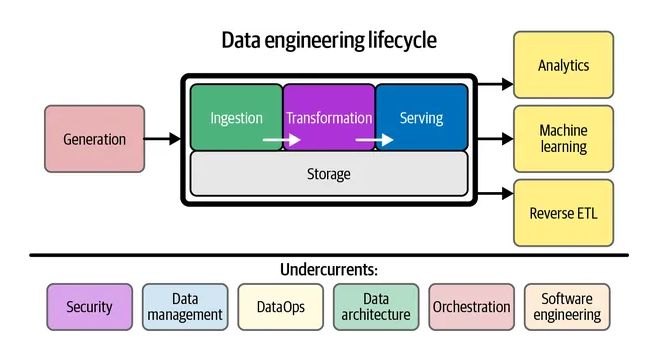
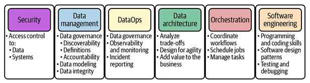
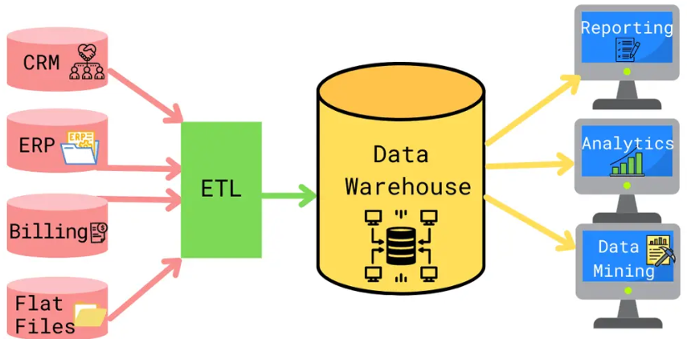

# Data Concepts Notes

## Data Engineering Life Cycle

**Generation**: DBMS stores data from the application. Data is generated from a variety of sources, such as transaction systems, sensors, social media

Source system is the origin of data. A source system could be an IoT device, an application message queue, or a transactional database

IOT swarm is when many devices sends data messages to a central collection system (IoT devices such as sensors or smart devices)

**Ingestion**: Fetching data from multiple sources. Extracting from applications or APIs. Source systems and ingestion represent the most significant bottlenecks of the data engineering lifecycle

**Storage**: Storing all the data that is fetched from multiple storage. Data architectures in the cloud leverage storage solutions that can support complex queries such as Amazon S3 Select

**Transformation**: Based on business logic or other requirements, perform a transformation. Use Airflow, Spark. Transformation involves applying logic on top of data such as removing null values, filtering, aggregations, authenticating data, dropping duplicates

**Serving**: Uploading transformed data on to the Data Warehouse. Serve benefits to stakeholders

  - Analytics - reports, dashboards, data analysis (BI, operational, embedded analytics)
  - ML - serving data used for prediction or decision making
  - Reverse ETL - feeding results of transformed data back into a source or other system for further data engineering or use

**Undercurrents**: support all data engineering efforts.  

 - Security: principle of least privilege, individuals with access to data must understand their responsibility, provide access only for duration to perform the work, encryption, tokenization, data masking, obfuscation, access controls
 - Data Management: Data governance engages people, processes, and technologies to maximize data value across an organization while protecting data with appropriate security controls, Data must be discoverable and available, metadata (data about data), data accountability, data quality (accuracy, completeness, timeliness), data lineage, ethics and privacy
 - DataOps: technical practices, agile workflow that enables rapid innovation delivering insights to customers with increasing velocity, high data quality and low error rates, collaboration across people, tech, environment, clear measurement, monitoring, and transparency or results, automation
 - Data Architecture: A data architecture reflects the current and future state of data systems that support an organization’s long-term data needs and strategy. Understand the business needs, requirements for new use cases, deign best way to capture and serve data, balanced for cost and operation simplicity.
 - Orchestration: process of coordinating many jobs to run as quickly and efficiently as possible on a scheduled cadence. A scheduler, such as cron, is aware only of time; an orchestration engine builds in metadata on job dependencies, generally in the form of a directed acyclic graph (DAG). The DAG can be run once or scheduled to run at a fixed interval of daily, weekly, every hour.
 - Software Engineering: Writing core data processing code in languages such as Spark or SQL, developing open source frameworks, data processing tasks such as joins in real time, windowing methods for real-time systems to calculate valuable metrics, streaming processors such as Spark for analysing streams, Infrastructure as code (IaC) applies software engineering practices to the configuration and management of infrastructure (companies migrate to big data systems such as Databricks and Amazon Elastic MapReduce)

 ref: https://learning.oreilly.com/library/view/fundamentals-of-data/9781098108298/ch02.html#security-id000029

 ## Data Warehouse

 A data warehouse is a centralized repository that stores data from various sources, such as transactional systems, applications, and external sources. It is designed to support business intelligence activities, such as reporting, data analysis, and data mining. Unlike transactional databases, which are designed for day-to-day operations, data warehouses are designed for complex queries and analysis

 - Integrated: Data from various sources is integrated and transformed into a common format to ensure consistency and accuracy
 - Time-Variant: Data in a data warehouse is stored over time, enabling users to analyse trends and changes over time
 - Subject-Oriented: Data in a data warehouse is organized around business functions or subjects, such as sales, finance, and marketing

 ## Benefits of Data warehouse
 - Improved decision making as it provides timely and relevant information to support decision-making processes. Access to historical and real-time data along with advanced analytics help make data-driven decisions.
 - Improved operational efficiency as it provides a centralized repository to retrieve data quickly
 - Enhanced data quality due to cleaning, transformation, and validation which ensures data accuracy and consistency (single version of the truth is the data warehousing ideal of having either a single centralised database which stores all of an organisation's data in a consistent and non-redundant form)
- Robust security as it provides access controls/privileges/user authentication, encryption of sensitive data, data masking and redaction, compliance with data protection regulations
- Gaining a Competitive Advantage: A data warehouse provides insights into customer behaviour, market trends, and competitor activities, providing a competitive advantage.

A Data mart is a subset of a data warehouse that is designed to serve the specific needs of a particular group of users or a specific business function within an organization

- Created to support analytical and reporting needs of a specific department, business unit
- Contain limited set of data that is relevant to the business need which is often aggregated, transformed, and optimised
- Schema for the type of queries required by the specific user group and differs from the schema used in the data warehouse
- Store aggregated and summarised data and optimised for query performance so its fast for retrieving
- Users of data marts use BI tools, reporting tools and analytics platforms

Technology - to maintain data warehouses
- Amazon redshift
- Teradata
- Oracle
- Panoply
- Cloudera
