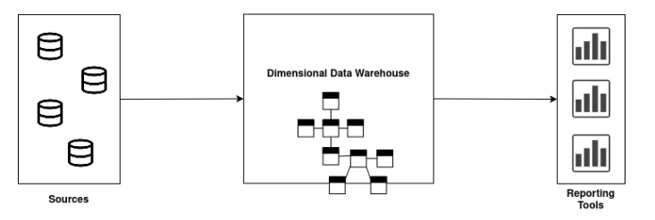
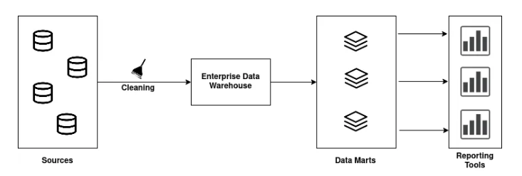

# Architecture for Data Warehouse

## Kimball Architecture

- Identify the business requirements, design the dimensional model, implement ETL process, develop data access tools
- Dimensional data warehouse - centred around dimensional modelling meaning data is arranged into fact tables containing quantitative measures and dimension tables with descriptive attributes
- Star and snowflake schema - The star schema has a central fact table connected to dimension tables, making it simple to understand and query. The snowflake schema is an extension of the star schema, with dimension tables further normalized
- Bottom-Up approach - separate data marts, designed for specific needs of individual departments or business units are created first and constructed incrementally allowing for quicker delivery of results
- Dimensional data warehouse combines data from Data marts. This centralization enables organization-wide reporting and analysis while maintaining the agility and responsiveness provided by data marts
- Scalability through data marts - dimension modelling focus allows more data marts to be added for specific departments, resulting in faster time to value as data marts are deployed and developed more independently of the central data warehouse

Advantages:
- Fast time to value due fast creation of data marts
- Aligning data marts with single departments is faster as is leverages existing structure and relational data resulting in immediate business value
- Star schema simplifies querying and analysis due to its denormalised structure
- Cost-effective as avoiding extensive normalization makes Kimball less expensive to set up and quicker to implement

Disadvantages:

- Maintaining data consistency as data marts may have different structures
- Data redundancy and increased storage requirements as data duplicated across data marts
- Adding columns to the fact table can cause performance issues as fact tables are designed to be very deep, so if new columns are to be added, the size of the fact table becomes much larger affecting performance
- Difficult to modify the dimensional data warehouse model to accommodate any change in business requirements
- Updating data can cause irregularities due to redundant data
- Complex process of incorporating large amounts of legacy data into the data Warehouse
- One source of truth lost as data is not fully integrating before serving

## Inmon Architecture

- Enterprise data warehouse - An EDW is a centralized repository of an organization's data. It's designed to store, manage, and provide access to data from various sources and contains historical and current data, intended to be a single source of truth
- Top-Down approach - First create a large, integrated, centralised data Warehouse
- Normalised data warehouse - Identify entities and relationships, create normalised tables, eliminate redundancy, use primary and foreign keys, apply normal forms (This approach is beneficial for data integrity and consistency but can be more complex for querying and reporting)
- Data is summarised and subsets of data are distributed to data marts where data marts are designed for reporting and analytic needs of specific business departments allowing for efficient querying and analysis by end-users
- High effort for data mart requests - significant effort involved in understanding and fulfilling the data requirements of each department
- Data is non-volatile meaning data in the data warehouse is never overwritten or deleted (storage retained if power lost)
- Follows principle of if its not written to often, recreate it
- Scalable through centralisation - scaling up involves expanding the central data warehouse infrastructure which is efficient in terms of data integration but ETL processes become complex as data grows; leading to longer development cycles or resource intensive scaling-efforts

Advantages:
- data warehouse serves as the single source of truth for the enterprise, as it is the only source for the data marts and all the data in the data warehouse is integrated and consistent
- Data update anomalies are avoided because of low redundancy, making the ETL process easier and less prone to failure
- Business processes understood easily as logical model has detailed business entities
- Improved data quality due to integration and data cleaning
- Flexible as its easy to update the data warehouse as business requirements change or source data changes

Disadvantages:

- Implementation and querying becomes complex due to more tables and joins, resulting in less efficient query performance
- Requires experts in data modelling and experts in business processes which is costly
- Initial set up cost is high due to full normalisation, delivery takes more time, and maintenance requires experts
- Since data marts are developed following the development of the data warehouse, additional ETL process operations are necessary

## Use Cases

Kimball Methodology:
- Data Warehousing for Business Intelligence (BI)
- Scalable and Agile Solutions
- User-Friendly for Business Analysts
- Rapid Development
- Example use cases - Retail sales analysis, e-commerce performance, Marketing Campaign Analysis

Inmon Methodology:
- Enterprise Data Warehousing
- Data Integration and Data quality
- Historical Analysis and Data Preservation
- Complex Transformation and ETL
- Example use cases - Healthcare Patient Records, Financial Regulatory Compliance, Manufacturing Process Optimisation, Airlines Flight Data Analysis
