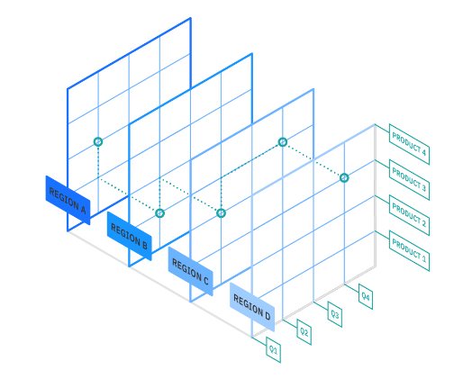

# Relational Data Processing - OLTP vs OLAP

Both online analytical processing (OLAP) and online transaction processing (OLTP) are database management systems for storing and processing data in large volumes. They require efficient and reliable IT infrastructure to run smoothly. Used to query existing data or store new data and both support data-driven decision-making in an organization

Most companies use OLTP and OLAP systems together to meet their business intelligence requirements

## OLTP - Online Transaction Processing

- OLTP is a type of database system designed for managing and processing real-time transactional data such as order processing, inventory management, and CRM
- OLTP systems typically use a highly normalized data model; data is organized in a way that minimizes redundancy, and tables are designed to reduce data duplication (data integrity, consistency, and optimised write operations)
- Allows efficient and reliable real-time processing of online transactions at scale
- Collect and store data from multiple sources—such as websites, applications, smart meters, and internal systems
- High speed and efficient processing of transactions
- Transactions are processed in real-time allowing business decisions based on this database
- Heavy write, low read (high updating, inserting, deleting data, low querying of data)
- Examples: ATM transactions, POS systems, Online shopping carts, Online banking

## OLAP - Online analytical processing

- OLAP is a category of data processing that is focused on analysing and querying large volumes of historical and aggregated data to support decision-making and business intelligence.
- Used for performing multi-dimensional analysis at high speeds on large volumes of data
- OLAP systems are designed for complex queries with data from multiple sources. Users can explore data from various dimensions and perform operations like slicing (selecting a subset of data), dicing (breaking data into smaller parts), and drilling (navigating into more detailed data)
- OLAP adds a layer of abstraction and aggregation to the data, making it easier to perform complex analytical queries and generate reports without having to deal with the intricacies of the underlying transactional data
- In OLAP, a semantic data model is used to describe the meaning of data elements. This model defines the relationships between different data elements and their attributes
- Heavy read, low write
- Examples: Sales analysis, Financial reporting, Customer segmentation, Market Research
- Data Integrated from Multiple Sources and Aggregated Across Multiple Dimensions (OLAP Cube)

- An OLAP cube is a data structure used in business intelligence that organises data in multiple dimensions, storing pre-aggregated measures for efficient analysis. It enables users to quickly explore data from various angles, perform complex queries, and gain insights through slicing, dicing, and drilling into data
- OLAP cubes are often designed on top of transactional systems, such as relational databases. These cubes provide a more efficient way to analyze and report on data compared to running complex queries directly on the transactional database. They serve as an additional layer that optimizes data retrieval for analytical purposes
- OLAP Cube can be an additional server, for example, that is designed on top of database that aggregates data,
- OLAP can also be a data warehouse, designed for analytics, when creating data marts (specific for each business department) for answering business intelligence questions
- In the case of  relational and highly normalised databases, querying can be difficult due to multiple table joins. So use a denormalized model on top that is easier for analysis that is not often written to but updated quarterly for instance. Denormalized databases mean updating or inserting data will take time due to data redundancy. It also incurs heavy read and ease of querying, but as it is not often written to, it is beneficial for important business decisions where data spans across multiple years. It's not designed for quick analytics

- OLTP transactional processing suitable for relational SQL type database
- OLTP sytems include MYSQL, PostgreSQL
- OLAP analytic processing suitable for Data
- OLAP systems include SnowflakeDB, Amazon Redshift, Google BigQuery, Apache Hive, Synapse Analytics (Azure)

## Use case
Retail company that operates hundreds of stores across the country and uses a huge database to track sales, inventory, customer data.

Use OLTP to process transactions in real-time such as updating inventory and managing customer account. Each store connects to central database which updates inventory in real-time as products sold. Use OLTP to manage customer accounts—for example, to track loyalty points, manage payment information, and process returns

Use OLAP to analyse data collected by the OLTP. The company’s business analysts can use OLAP to generate reports on sales trends, inventory levels, customer demographic. They perform complex queries on large volumes of historical data to identify patterns and trends that can inform business decisions. They identify popular products in a given time period and use the information to optimize inventory budgets.

## Moving data from OLTP To OLAP using ETL
- OLTP data extraction of sales transactions through various methods such as API calls, database queries, log file parisng
- Data is transformed by cleaning, aggregation, and data modeling to match the schema of the OLAP system (involves creating multidimensional data models or OLAP cubes that are optimized for analytical queries )
- Load the transformed data into OLAP system where data analyst/scientist and business decision makers can run complex queries and generate reports
- This pipeline ensures that organizations can leverage both their transactional data for day-to-day operations and analytical data for making data-driven decisions and gaining business insights

## Summary of Differences

| Criteria       | OLAP                                                           | OLTP                                                      |
|----------------|----------------------------------------------------------------|-----------------------------------------------------------|
| Purpose        | OLAP helps you analyse large volumes of data to support decision-making. | OLTP helps you manage and process real-time transactions.  |
| Data source    | OLAP uses historical and aggregated data from multiple sources. OLTP uses a traditional DBMS to accommodate a large volume of real-time transactions.  | OLTP uses real-time and transactional data from a single source. n OLAP database has a multi-dimensional schema, so it can support complex queries of multiple data facts from current and historical data. Different OLTP databases can be the source of aggregated data for OLAP, and they may be organized as a data warehouse. |
| Data structure | OLAP uses multidimensional (cubes) or relational databases.  | OLTP uses relational databases.                             |
| Data model     | OLAP uses star schema, snowflake schema, or other analytical models. | OLTP uses normalized or denormalized models.               |
| Volume of data | OLAP has large storage requirements. Think terabytes (TB) and petabytes (PB). | OLTP has comparatively smaller storage requirements. Think gigabytes (GB).  |
| Response time  | OLAP has longer response times, typically in seconds or minutes. | OLTP has shorter response times, typically in milliseconds.  |
| Processing time  | In OLAP, response times are orders of magnitude slower than OLTP. Workloads are read-intensive, involving enormous data sets. | For OLTP transactions and responses, every millisecond counts. Workloads involve simple read and write operations via SQL (structured query language), requiring less time and less storage space.  |
| Example applications | OLAP is good for analysing trends, predicting customer behaviour, and identifying profitability. | OLTP is good for processing payments, customer data management, and order processing.  |
