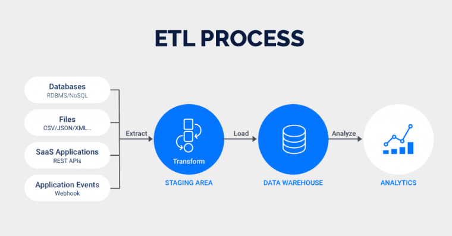
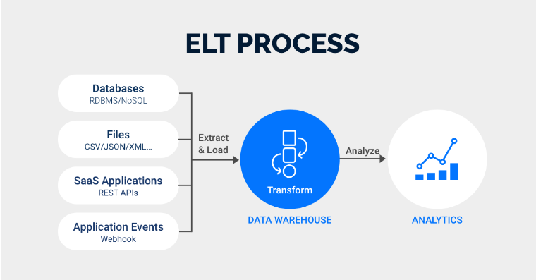

# ETL Vs ELT

ETL (Extract, Transform, Load) and ELT (Extract, Load, Transform) are two approaches used in data processing and management within data warehouses or data integration workflows.

ETL (Extract, Transform, Load):
- Extract: This phase involves pulling data from various sources such as databases, files, or APIs.
- Transform: Data goes through a series of transformations where it's cleaned, filtered, aggregated, and standardized to fit the target data model or schema. This could involve joining tables, removing duplicates, or converting data types.
- Load: Finally, the transformed data is loaded into the target database or data warehouse. In traditional ETL processes, transformations are performed before loading the data into the target system.

ELT (Extract, Load, Transform):
- Extract: Similar to ETL, data is first extracted from different sources.
- Load: The extracted data is then immediately loaded into the target system without substantial transformations. It's stored in its raw form or minimally processed within the data warehouse.
- Transform: Transformation occurs within the data warehouse or target system itself. Once the data is loaded, it's transformed as needed for analysis, reporting, or other purposes. This approach leverages the computing power of modern data warehouses to handle transformations on large volumes of data.

# ETL and ELT process

|

