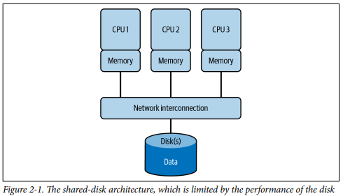
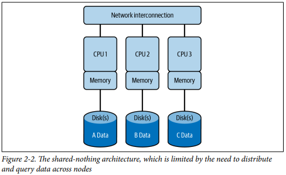
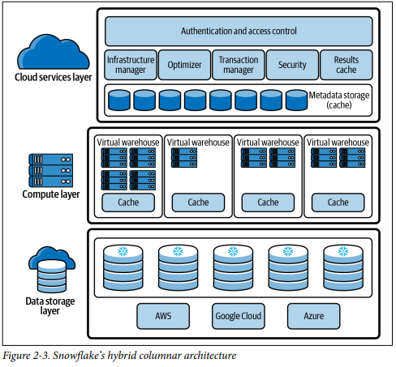

# Traditional Architecture

Scalability is the ability of a system to handle an increasing amount of work.

- Shared-Disk (Scalable) Architecture

  - Early approach designed to keep data in central storage location
  - Data is accessible from multiple data base cluster nodes
  - All modifications written to the shared disk meaning data is consistently available
  - Requires complex on-disk locking to ensure data consistency
  - Data concurrency, doesn't allow many users to affect multiple transactions in the databases

  /

- Shared-Nothing (Scalable) Architecture

  - storage and compute are scaled together in response to bottlenecks created by shared-disk
  - distributed cluster nodes requires data to be shuffled between nodes, adding overhead
  - organizations often over provision shared-nothing resources, which results in unused, unneeded resources

  /

# Snowflake Architecture

Snowflake is a cloud-based data warehousing platform that allows users to store, process, and analyse large amounts of structured and semi-structured data. It was designed from the ground up to be a cloud-native solution, meaning it was built with the cloud in mind.

  /

- Cloud services layer - responsible for managing security, user authentication, access control, and metadata. It includes services such as the Snowflake web interface, which allows users to interact with Snowflake, as well as the Snowflake REST API, which allows developers to programmatically interact with Snowflake
- Computer layer - handles query processing and execution. It comprises virtual warehouse which are clusters of compute resources used for running queries. Snowflake automatically determines the optimal amount of compute resources needed to complete the query based on the size and complexity of the data being queried.
- Data storage layer - Snowflake stores data in a format called the Snowflake database storage which is optimised for cloud storage and leverages cloud storage like Amazon S3, Google Cloud Storage, Azure Blob Storage. Data is organized into micro-partitions, small units that enable efficient pruning and querying of data. This allows Snowflake to perform operations on just the necessary micro-partitions rather than the entire dataset, enhancing performance.The data stored in Snowflake is immutable, meaning it cannot be changed. Any modifications to the data result in new versions, maintaining a history of changes, which is beneficial for auditing and compliance purposes.This architecture supports a multi-cluster, shared data approach. The separation of storage and compute enables multiple compute clusters to access the same data concurrently without affecting its integrity.

# Advantages of Snowflake architecture
- Scalability - separation of compute and storage means compute resources can be scaled up or down independently of storage resources, providing elasticity (on demand scaling of resources) which is cost effective.
- Concurrent Access - Its multi-cluster architecture supports multiple users and workloads concurrently accessing the same data without performance degradation. This is advantageous for organizations with diverse data needs
- Performance and Security - Fast query performance for large datasets. Data is stored as "micro-partitions," which are small, self-contained units of data that are compressed and encrypted. This allows Snowflake to quickly and efficiently read and write data, as well as ensure the security of your data.
- Flexibility - Snowflake's architecture is designed to be cloud-native, meaning it was built with the cloud in mind. This allows for flexibility in deployment and integration with other cloud-based services
- Ease of use - SQL-based interface and user-friendly console makes it accessible to business users. It abstracts complexity of managing infrastructure, allowing focus on analytics

# Disadvantages of Snowflake architecture
- Cost - Cloud based service includes costs meaning pricing can accumulate, especially as data volume and usage increase
- Connectivity - connectivity issues can disrupt data access and impact operations
- Complexity in Migration - Migrating data from existing systems or integrating with other platforms might pose challenges due to differences in data formats and structures. This could require some effort and time for a seamless transition.
- Limited Control over Infrastructure - Snowflake abstracts much of the infrastructure management, which can be advantageous for many users. However, for those needing specific control or customization over hardware and software configurations, this might be a limitation
- Potential vendor lock in - Moving data in and out of Snowflake can involve complexities, and organizations might find themselves tightly integrated into Snowflake's ecosystem
