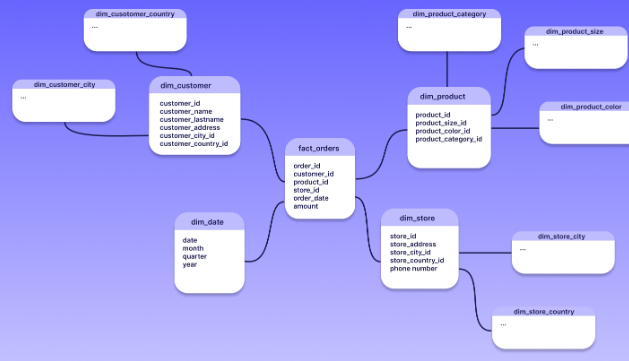

# Dimensional Modelling

It is the technique of storing data in a Data Warehouse in such a way that enables fast query performance and easy access to its business users. It involves creating a set of dimensional tables that are designed to support business intelligence and reporting needs.

-  Inmon integrates data from across the business in the data warehouse, and serves department-specific analytics via data marts, the Kimball model is bottom-up, encouraging you to model and serve department or business analytics in the data warehouse itself

# Fact Table
- Fact tables contain quantitative data, often referred to as measures or metrics, that represent the business processes or events. These measures are usually numeric and can be aggregated. Examples include sales amount, quantity sold, profit
- Each row in a fact table corresponds to a specific event or transaction. The granularity defines the level of detail captured by the fact table
- Fact tables have foreign keys that link to the primary keys of dimension tables. These foreign keys provide the context and details necessary to interpret the measures in the fact table
- Fact tables often store aggregated data as well. For example, in addition to individual sales transactions, a fact table might contain pre-calculated summaries like total sales per day, per product, to optimize query performance

# Dimension table
- Dimension tables contain descriptive attributes or context related to the business process captured in the fact table. They provide the necessary context for analysing the measures in the fact table
- Dimension tables store non-numeric attributes that describe the characteristics of the business entities. For instance, in a sales scenario, dimension tables might include product details (name, category, description), customer information (name, address, demographics), time details (date, month, year)
- Dimension tables often have hierarchical structures. For instance, a time dimension might have a hierarchy of year > quarter > month > day, allowing analysis at different levels of time granularity
- Dimension tables are linked to fact tables through primary key-foreign key relationships. The foreign keys in the fact table point to the primary keys in the dimension tables, enabling analysts to connect the measures in the fact table with the relevant descriptive attributes in the dimension tables

# Fact and Dimension
- Fact Table
  - Foundation of Data warehouse
  - Key measurements
  - Aggregated (numerical values) and easily analysed
  - Measurable vs descriptive
  - Event-or transactional Data
  - Data/time in a fact table
  - Summary:
    - PK of fact table, FK that connects to dimension table, Facts such as Price, Revenue
    - Grain: Most atomic level facts are defined
    - Different types of facts

- Dimension Table
  - Categorises facts (category, subcategory, product name, customer name)
  - Supportive and descriptive (not measurable)
  - Filtering, grouping, labelling
  - non Aggregated
  - descriptive vs Measurable
  - static (slowly changing dimension)
  - Summary:
    - PK, Dimension, Optional FK
    - People, products, places, optimize
    - Different types of dimensions

# Star Schema

- Star schema architecture revolves around a central fact table that holds quantitative measures or metrics, surrounded by dimension tables that provide context and descriptive attributes
- Denormalised structure as data is repeated across dimension tables to improve query performance
- Reduces the number of joins required for complex queries
- Potential data redundancy and data integrity issues
- Optimised to get data out
- Query performance (read)
- Better readability and simplifies query design for users across the business
- Most common schema in data mart (personalised tables used for different business teams based on specific needs or requirements)
- Usability and performance for specific (read) use cases
- Used in data warehouses for sales and marketing analysis, financial reporting, inventory management

# Snowflake Schema

- The snowflake schema extends the star schema concept by normalizing dimension tables in a data warehouse. This means breaking down dimension tables into sub-dimensions, creating a more intricate and normalized structure
- ideal for large volumes of data where data relationships are complex and involve multi-level hierarchies and attributes
- Normalised structure reduces redundancy, improves integrity, increases storage efficiency
- Difficult for business users to understand and analyse
- More complex SQL queries and more joins lead to slower performance as multiple joins needed to retrieve data from normalised tables but modern data optimisation techniques have reduced the performance gap. These techniques include:
  - materialised view - query results stored in separate tables to improve query performance by reducing need for real time data joins and aggregations
  - partitioning - divides larger tables into smaller manageable partitions based on specific criteria reducing the amount of data queried during execution of queries
  - indexing - creates searchable structures on table columns for faster data retrieval. Indexes are beneficial for columns frequently used in WHERE clauses and JOIN operations
  - Data aggregation - pre-summarising data at different grains or levels of details such as daily, weekly, monthly reducing the amount of data processed during query execution, especially for complex aggregations
-  Used in data warehouses that facilitate analytics in Customer Relationship Management (CRM), e-commerce platforms, and supply chain management.

# Detailed Comparison

|                | Star Schema    | Snowflake Schema    |
| :------------- | :------------- | :------------- |
| Architecture      | Fact table with denormalised dimension tables       | Fact table with normalised dimension tables       |
| Complexity      | Simpler to understand an design due to minimal normalisation. Easy querying due to less joins, so better query readability for business users     | More complexity due to normalisation. Sub-dimensions leads to more tables and relationships. Schema design, querying, and maintenance is more challenging      |
| Normalisation      | Denormalised. Intentionally denormalised to speed up performance which creates data redundancy, more storage use, and decreased data integrity    | Normalised. Avoids data redundancy by storing dimensional data in separate tables, improving data quality and reducing required storage space       |
| Performance      | Better performance for analytical queries, since most required data is contained within a single or few tables, queries involve fewer joins meaning faster query execution times       | Multiple joins required to retrieve data from normalised tables, meaning less performance data marts/cubes. Difficult for business users to understand. However data optimisation techniques have reduced the performance gap    |
| Data      | suitable for simple data structures and star-like relationships       | Suitable for complex data relationships      |
| Query maintenance      | Easier maintenance since dimensional changes only impact the fact table      | Challenging maintenance as dimensional changes impact other tables       |
| Storage      | Requires more storage due to data redundancy       | Requires less storage due to normalised structure      |

# Choosing Between Star and Snowflake Schemas
- Data complexity - complexity of data relationships
- Query complexity - types of queries the business needs to run (aggregations, reporting, data analysis or detailed normalised data for complex queries)
- Performance vs maintenance
- Available expertise in schema design, database optimisation and maintenance
- Data volume - impact on storage costs
- Future scalability - evolving query complexity or increase in tables
- Tool and platform compatibility - querying or reporting tools are more optimised for certain schemas
- Business goals - Star schema is good for quick insights whereas snowflake provides more detailed analysis

# Hybrid models

- Galaxy Schema: The Galaxy schema or Fact Constellation is a hybrid approach with multiple fact tables, each with its own associated dimensional tables. This allows for representing different business processes or data sources within the same schema
While maintaining denormalized aspects for performance, the Galaxy schema might also incorporate normalized dimensions for more complex data relationships
- Starflake Schema: This hybrid approach involves having some dimensions in a denormalized star schema format while using a snowflake-like structure for more complex dimensions

# Tools an technologies
- Columnar database - Modern columnar data warehouse solutions like Amazon Redshift, Google BigQuery, and Snowflake have optimized storage and query processing for analytical workloads. They can handle snowflake and star schemas efficiently
- In-Memory Processing: Technologies like in-memory databases and caching mechanisms have improved the speed of querying, which can mitigate the performance impact of complex snowflake schemas
- Data Virtualization: Data virtualization tools allow querying data across disparate sources without physically consolidating them into a single data model. This approach can reduce the need for extensive schema design upfront and provide a unified data view
- Data Lakes and NoSQL Databases: For unstructured and semi-structured data, data lakes and NoSQL databases offer flexibility in schema design. Hybrid models can be built by structuring data as needed while retaining schema-on-read capabilities
- Machine Learning and AI: Advanced analytics techniques can identify query patterns and suggest optimizations, aiding in creating and tuning schema structures
- Data Catalogs and Metadata Management: These tools help understand data relationships, lineage, and usage patterns, facilitating schema design decisions

# Types of Fact tables
- **transactional fact table**
  - 1 row = measurement of 1 event / transaction
  - Taken place at a specific time
  - One transaction defines the lowest grain
    - most common and very flexible
    - typically additive
    - tends to have  a lot of dimensions associated
    - enormous in size
    - example is bank transactions
- **periodic snap shot fact table**
  - 1 row = summarises measure of many events / transactions
  - summarised of standard period such as 1 day or 1 weekly
  - lowest period defines the grains (week_id or day_id)
    - not as large in size
    - typically additive
    - lot of facts and fewer dimensions associated
    - no events = null or 0
- **Accumulation snapshot fact table**
    - 1 row = summarises measure of many events / transactions
    - summarised of lifespan of 1 process (such as order fulfilment)
    - definite beginning and definite ending (and steps in between) such as Production start FK and Production end FK
      - least common
      - workflow or process analysis
      - multiple Date/Time foreign keys for each process steps
      - Date/Time keys associated with role-playing dimension
      - example is commerce (journey of product at every stage of delivery)

# Steps to create a Fact table
1. Identify business process for analysis (Kimball architecture)
  Example: Sales, Order Processing
2. Declare the grain
  Example: Transaction, Order, Order lines, Daily, Daily + location
3. Identify dimensions that are relevant (what, when, where, how, and why)
  Example: Time, locations, products, customers
4. Identify facts for measurement
  Example: Defined by the grain and not by specific use-case

# Factless Fact table
A factless fact table is a type of table in a dimensional model that contains no measures or numeric data. Unlike typical fact tables that store quantitative information (e.g., sales amount, quantity sold), a factless fact table captures events or occurrences that signify relationships between various dimensions

- Facts are usually numerical
- Sometimes only dimensional aspects of an event are recorded
- Event but no metrics
- FK from multiple dimensions without any associated measurements
- represents many-to-many relationships or events that occur between dimensions without having any numeric data to quantify them. These events are transactions
- Types:
  - Tracking vents - recording events such as student enrolment, appointment scheduling
  - Event tracking - tracking when a product is returned or when a customer upgrades a service
  - Aggregation and Analysis: While factless fact tables don’t contain measures, they can still be used for analysis by counting (COUNT) occurrences or determining patterns within different combinations of dimension
  - Example new employee is registered
    - How many employees have been registered last monthly?
    - How many employees registered in a region?

# Surrogate key
Natural keys and surrogate keys are both methods used in database design to uniquely identify records within a table

- A natural key is a data attribute or a combination of attributes that exists within the data and uniquely identifies each record in a table. These keys have real-world meaning or significance in the context of the data being stored
- Natural key comes out of the source system (RDBMS)
- A surrogate key is an artificially created, system-assigned, or generated key specifically designed to uniquely identify records within a table. It doesn't hold any business meaning and is solely used for identification purposes
- _PK or _FK suffix, integer number, created by the database / ETL tools
  - improves performance (less storage/better joins)
  - handle dummy values (nulls/missing values 999 or -1 )
  - integrate multiple source systems
  - easier administrate / update
  - sometimes there are no natural keys available
  - A lookup table, also known as a reference table or mapping table, is created to store the relationships between surrogate keys and corresponding natural keys from another table.This lookup table typically consists of at least two columns: one column for the surrogate keys and another column for the corresponding natural keys

# Date Dimension
- One of the most common and most important dimensions
- contains data related features
  - Year, Month (name and number), Day, Quarter, Week, Weekday (name and number)
  - Meaningful surrogate key YYYYMMDD
  - For example 2022-04-02 <-> 20220402 (surrogate key means grain of data will be on individual date level enhancing data quality)
  - Extra row for no date/null (source) <-> 1900-01-01 (dim) as dummy date value
- Time is usually a separate dimensions
- Can be populated in advance (for next 5 or 10 years)
  - Numbers and text - January, 1
  - Long and abbreviated - Jan, January - Mon, Monday
  - Combination of attributes - Q1, 2022-Q1
  - Fiscal dates - Fiscal year - FY24
  - Flags - Weekend, company holiday

  
